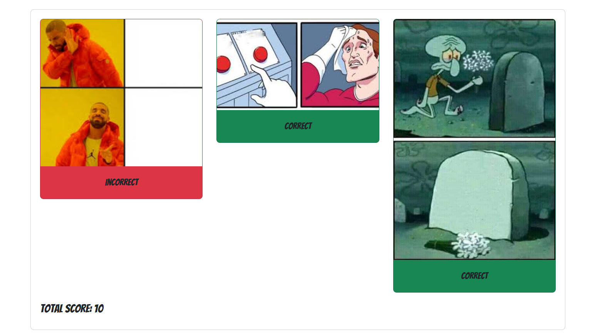
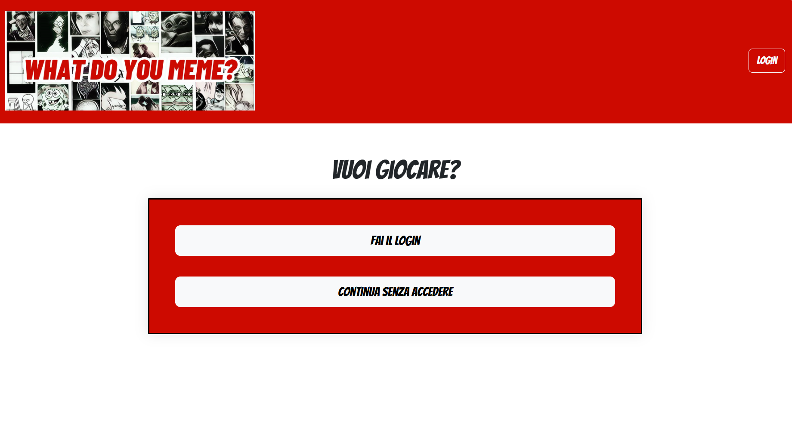
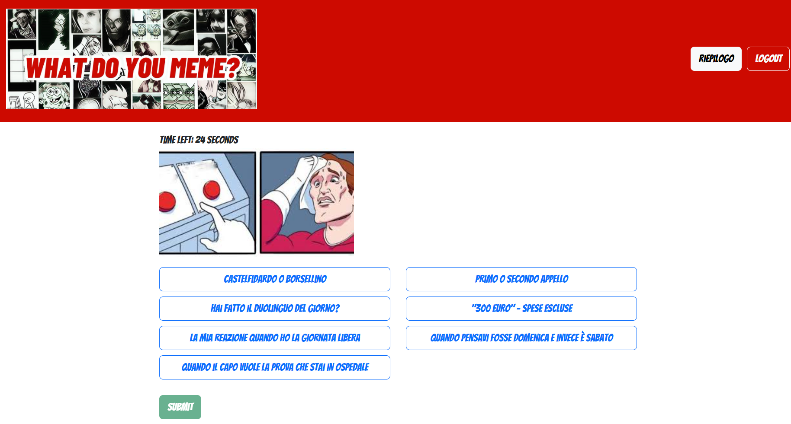

# What Do You Meme? – Meme Matching Web Game

This is a full-stack web application developed as an individual assignment for the **Web Applications I** course at Politecnico di Torino (2024).

It replicates a simplified single-player version of the "What Do You Meme?" board game. The player is challenged to correctly match the most fitting caption to a randomly selected meme image within a time limit.

## Project Purpose

The application is designed to deliver a fun, fast-paced game experience through an interactive meme-matching challenge.  
It supports both **registered** and **anonymous** users, providing gameplay tracking and scoring history for registered users, while keeping the experience accessible to unregistered visitors.

---

## How the Game Works

The game consists of multiple rounds depending on user type:

- **Anonymous users** can play one single round.
- **Registered users** play a full 3-round game, and all match results are saved to their profile.

### Each Round

- The user is presented with a **random meme image** and **seven caption options**.
- Among the options, **two are correct** (best-matching) captions for the image.
- The player has **30 seconds** to choose one caption.

### Scoring Logic

- If the player selects a correct caption: **+5 points**
- If the player selects an incorrect caption or time runs out: **0 points**
- At the end of each game, registered users see:
  - Total score of the session
  - List of memes shown, selected captions, and correct answers

Repeated memes are avoided within a session. The system tracks previously shown memes to maintain variety across games.

---

## User Functionality

- **Login/Logout**
- **View match history** (registered users only)
- **Start new game** (any time)
- **Play anonymously** (single round, no score tracking)

The application ensures a clear separation of functionality between registered and anonymous users, with appropriate access controls.

---

## Technologies Used

- **Frontend:** React (SPA), React Router, custom hooks
- **Backend:** Node.js, Express
- **Database:** SQLite
- **Authentication:** Passport.js with session-based login
- **Gameplay logic:** Randomized meme selection, caption shuffling, round state handling, and result validation

---

## Screenshots

### Summary – Registered User

### Home - Beginning

### Round - Registered User

---

## Author

Developed entirely by the repository owner as a solo project for academic purposes.  
For more information or questions, please reach out via GitHub.

## Year
2024

